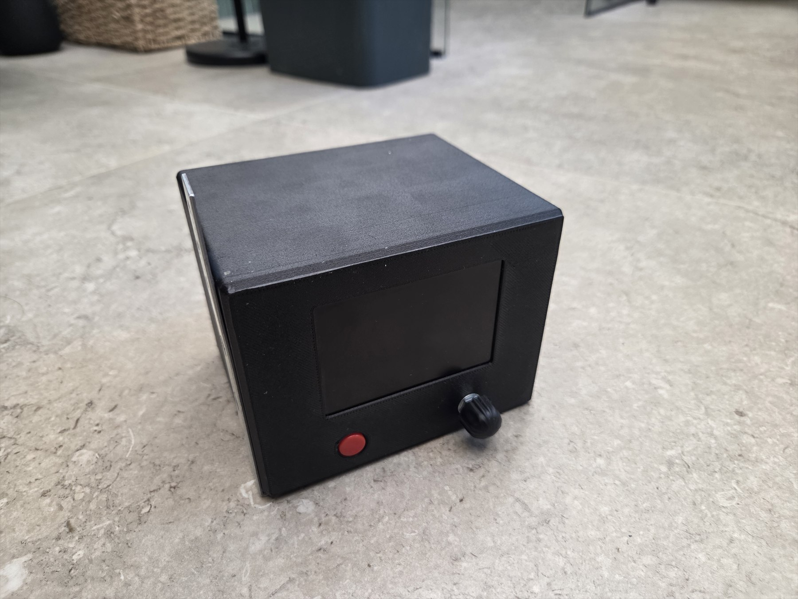

# Kiln Controller

Open-source ESP32-S3 kiln controller with local controls, a 480 × 320 display, program ramp/hold control, PID regulation, a web interface and browser-based firmware updates.



The controller output can be adapted to suit electric kilns with different power-control interfaces. The hardware built for this v0.4-series project uses a PWM-to-0–10 V converter: the ESP32 produces a 2 kHz, 12-bit PWM signal on GPIO39, and the external circuit converts it to the 0–10 V command expected by the kiln power regulator. To use another interface—such as a suitably isolated SSR or a different analog standard—replace or adapt the external output stage and update the small hardware-output layer in `src/control.cpp` as required.

> This repository contains controller firmware, not a universal mains-power circuit. Each kiln still needs a correctly rated and suitably isolated power stage, independent over-temperature protection, appropriate fusing and installation by someone qualified for the voltages involved.

## Current version

The imported working project reports firmware **0.4.1** and is the current version on `main`. The project and discussion refer to this generation collectively as v0.4.

## Hardware used by this build

- ESP32-S3 N16R8 development board
- ILI9486 480 × 320 TFT with 8-bit parallel interface
- MAX31855 interface and K-type thermocouple
- Rotary encoder with push button
- Physical STOP/Home button
- External PWM-to-0–10 V output circuit, using either a purchased module or the documented LM358 circuit
- 3D-printed controller housing

The [`hardware documentation`](hardware/README.md) includes the controller connection overview, LM358 PWM-to-0–10 V circuit, finished-product photos and downloadable enclosure models. The completed [`hardware/BOM.md`](hardware/BOM.md) lists the parts, variants and purchase links.

## Pin map

| ESP32-S3 | Connected device |
| --- | --- |
| GPIO1 | Encoder A |
| GPIO2 | Encoder B |
| GPIO4…11 | TFT D0…D7 |
| GPIO12 | TFT RS/DC |
| GPIO13 | TFT WR |
| GPIO14 | TFT RD |
| GPIO15 | TFT CS |
| GPIO16 | TFT reset |
| GPIO17 | MAX31855 CLK |
| GPIO18 | MAX31855 DO |
| GPIO21 | MAX31855 CS |
| GPIO39 | PWM to the 0–10 V interface |
| GPIO40 | Encoder button |
| GPIO42 | Physical STOP/Home button, active low |

GPIO47's onboard RGB LED is intentionally unused.

## Important output setting

The supplied working archive contains this setting in `src/app_config.h`:

```cpp
static constexpr bool ENABLE_REAL_HEATER_OUTPUT = true;
```

This means GPIO39 produces the commanded heater output when the controller is running. Set it to `false` before compiling firmware for display, menu, sensor or web-interface testing where no physical heater command should be generated. Confirm the complete output chain and fail-safe behavior before enabling it again.

`PWM_INVERTED` is `false` in this build. Verify the safe/off state of any replacement output interface; do not assume another power controller uses the same polarity or signal convention.

## Features

- Programmed ramp and hold control with PID.
- Manual temperature mode and protected manual power mode.
- Pause, hold and resume.
- Per-step and global maximum power limits.
- Actual and requested rate-of-rise display.
- Kiln-lag detection and ETA confidence.
- Elapsed and estimated remaining time.
- Nominal duration shown while browsing and starting programs.
- Last five program runs with result and actual elapsed time.
- Live actual-versus-target graph in the web interface.
- Power-failure recovery with explicit Resume/Discard; the heater does not automatically re-energize after reboot.
- Delayed start in 15-minute increments.
- Station Wi-Fi with DHCP and automatic reconnect.
- Setup hotspot started only from the local menu or web settings.
- Browser notifications while the controller page is open.
- Browser-based OTA firmware update.

### v0.4 display improvements

- Partial row redraws reduce flashing during encoder movement.
- Manual temperature, manual power, delayed-start and recovery editors update only the changing field or selection.
- Embedded, pre-rasterized Inter Display-based fonts.
- Larger current temperature and main-screen information.
- Full labels such as **Elapsed** and **Remaining**.
- Nominal program duration based on a 20 °C starting temperature. Live ETA adjusts during firing if the kiln cannot follow the requested ramp.

## Build with PlatformIO

1. Install [Visual Studio Code](https://code.visualstudio.com/) and the [PlatformIO IDE extension](https://platformio.org/install/ide?install=vscode).
2. Clone or download this repository and open its root folder in PlatformIO.
3. Review `src/app_config.h`, especially `ENABLE_REAL_HEATER_OUTPUT` and the pin assignments.
4. Build the `esp32-s3` environment.
5. For initial installation or a changed partition layout, upload over USB.

The PlatformIO configuration targets `esp32-s3-devkitc-1`, 16 MB flash, QIO/OPI memory, LittleFS and the supplied A/B [`partitions.csv`](partitions.csv). PlatformIO installs the declared ArduinoJson and Adafruit MAX31855 dependencies automatically.

The application image is generated at:

```text
.pio/build/esp32-s3/firmware.bin
```

## Browser update from v0.3

v0.3 and v0.4 use the same A/B partition table. If v0.3 is already installed:

1. Build the current firmware in PlatformIO.
2. Open the kiln web interface and make sure the controller is **IDLE**.
3. Open **Settings → System / firmware**.
4. Select `.pio/build/esp32-s3/firmware.bin` and choose **Upload & install**.
5. Do not interrupt power during upload or reboot.
6. Reconnect and verify that the displayed firmware version matches `FIRMWARE_VERSION` in `src/app_config.h`.
7. Confirm that saved programs and settings remain present.

A controller using an older single-application partition layout must be installed over USB once before browser OTA can use the supplied A/B layout.

## Stored data

- Programs: LittleFS `/programs.json`
- Last five runs: LittleFS `/runs.json`
- Power-failure recovery checkpoint: LittleFS `/recovery.json`
- Settings and Wi-Fi credentials: NVS/Preferences

Normal application OTA replaces the inactive application partition and is intended to preserve LittleFS and NVS data.

## Documentation

- [`CHANGELOG.md`](CHANGELOG.md) — reconstructed version history
- [`hardware/BOM.md`](hardware/BOM.md) — parts, variants and purchase links
- [`hardware/README.md`](hardware/README.md) — connection overview, LM358 circuit, photos and enclosure files
- [`hardware/photos/README.md`](hardware/photos/README.md) — finished controller and build gallery
- [`hardware/case/README.md`](hardware/case/README.md) — STL, 3MF and STEP enclosure downloads
- [`docs/LICENSING.md`](docs/LICENSING.md) — license choice and third-party checks
- [`docs/releases/v0.4.1.md`](docs/releases/v0.4.1.md) — current release-note draft

## License

The original project source and documentation are released under the [MIT License](LICENSE), copyright © 2026 Brage (Vanebo). Embedded font data and downloaded build dependencies retain their respective upstream licenses; see [`THIRD_PARTY_NOTICES.md`](THIRD_PARTY_NOTICES.md).
