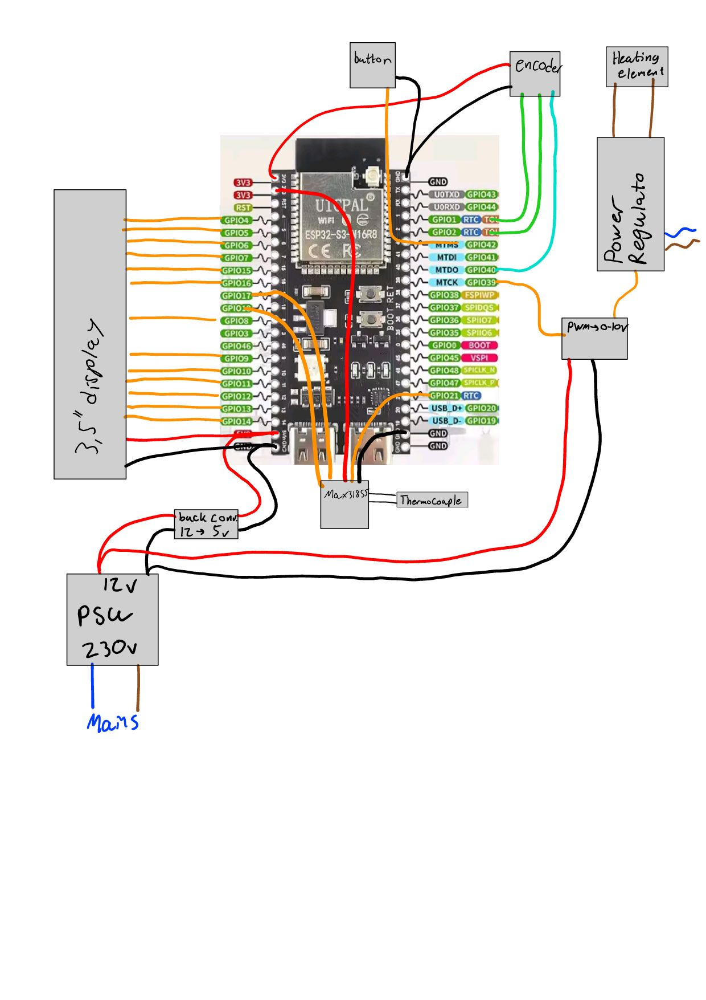
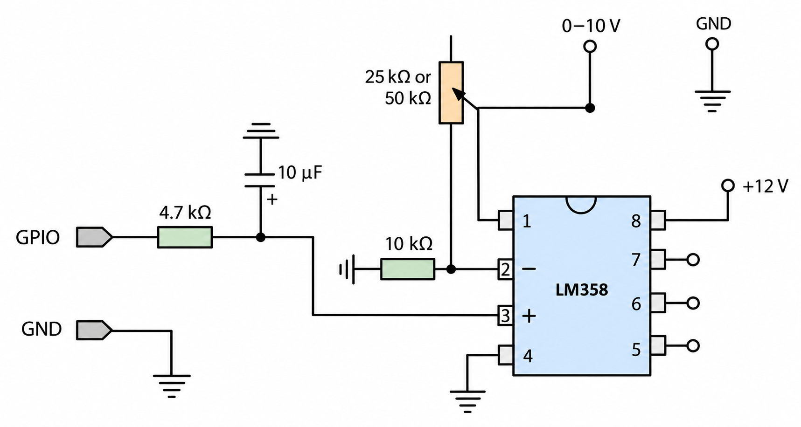

# Hardware

This folder documents the working controller build, the optional LM358 output circuit, the printed enclosure and the finished unit. See [`BOM.md`](BOM.md) for the parts list and purchase links.

## Controller connection overview

This drawing shows how the display, encoder, stop button, MAX31855 thermocouple interface, power supplies, 0–10 V output and kiln power regulator connect as functional blocks. It is an assembly overview, not a PCB schematic or a complete mains-wiring drawing. Use the firmware pin map in the main [`README.md`](../README.md#pin-map) for the ESP32 connections.

The current build uses:

- a 230 V AC to 12 V DC supply;
- an adjustable buck converter set to the voltage required by the controller electronics;
- a 2 kHz, 12-bit PWM command from ESP32-S3 GPIO39;
- a PWM-to-0–10 V converter; and
- a separate kiln power regulator selected for the kiln supply, phase arrangement and heating-element current.

The mains side, conductor sizes, fusing, earthing, disconnects, over-temperature protection and power-regulator cooling depend on the kiln and installation. They are outside the scope of the overview drawing and must be designed and checked by a qualified person.

## PWM-to-0–10 V output

The purchased PWM-to-voltage module in the [`BOM`](BOM.md) can be replaced by this LM358 circuit:

The 4.7 kΩ resistor and 10 µF capacitor low-pass-filter the PWM signal. One half of the LM358 is configured as a non-inverting amplifier. The 10 kΩ resistor and adjustable 25 kΩ or 50 kΩ feedback resistor set the gain so a full-scale PWM command produces 10 V. The LM358 is powered from 12 V.

The drawing focuses on the signal path. Add a 100 nF ceramic bypass capacitor close to LM358 pins 8 and 4. Do not leave the unused amplifier inputs floating: connect pin 5 to ground and connect pin 6 to pin 7 so the second channel operates as a stable follower.

This circuit shares signal ground between the ESP32 side and the 0–10 V input. Confirm that the connected power regulator provides a suitable isolated control input. Add an isolated interface if the kiln hardware requires one.

Before connecting the output to the kiln:

1. Keep the heater output disabled in firmware or disconnect the kiln power regulator.
2. Apply 12 V to the LM358 circuit and confirm the supply polarity.
3. Command 0% output and verify the output is close to 0 V.
4. Command 100% output and adjust the feedback trimmer to 10.00 V.
5. Check several intermediate commands for a stable, approximately linear output.
6. Verify that loss of controller power and a disconnected signal produce the intended safe state.

## Enclosure and 3D files

The printable housing is available in three formats:

- [`kiln-controller-housing.3mf`](case/kiln-controller-housing.3mf) — preferred for slicing;
- [`kiln-controller-housing.stl`](case/kiln-controller-housing.stl) — mesh format; and
- [`kiln-controller-housing.step`](case/kiln-controller-housing.step) — editable solid model.

See the [`case` notes](case/README.md) before printing. Check dimensions and connector clearances against your exact display, buttons, terminals and modules.

## Finished controller and build photos

The full [photo gallery](photos/README.md) includes front and rear views, the MAX31855 module, the output and power boards, and the internal wiring layout.
