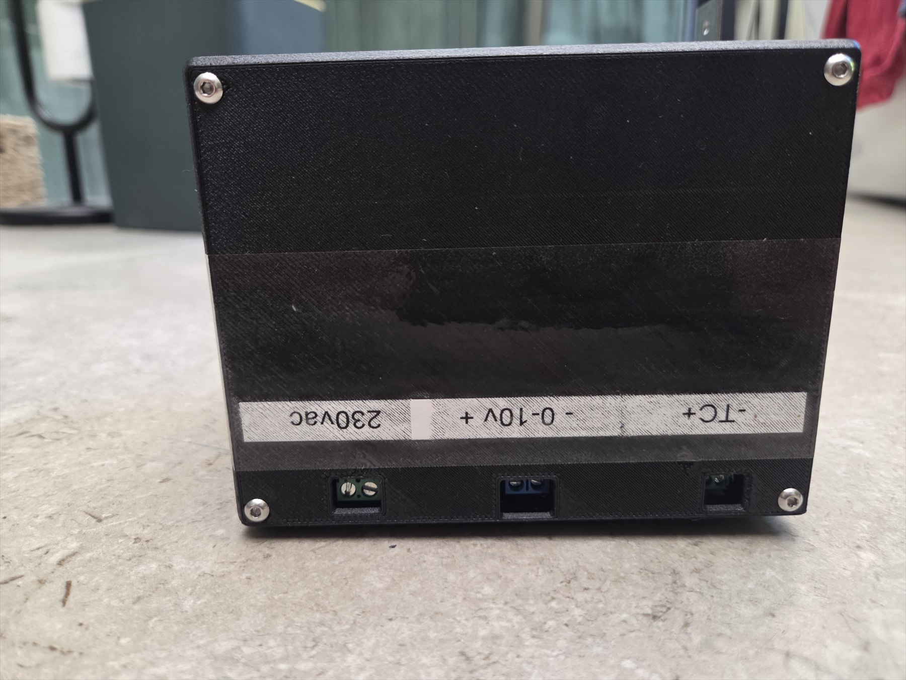
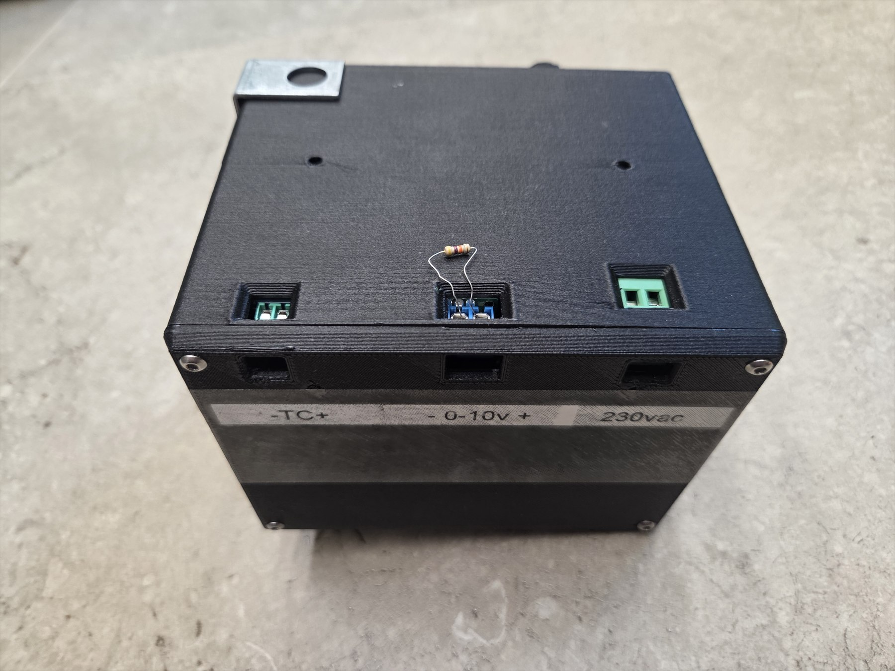
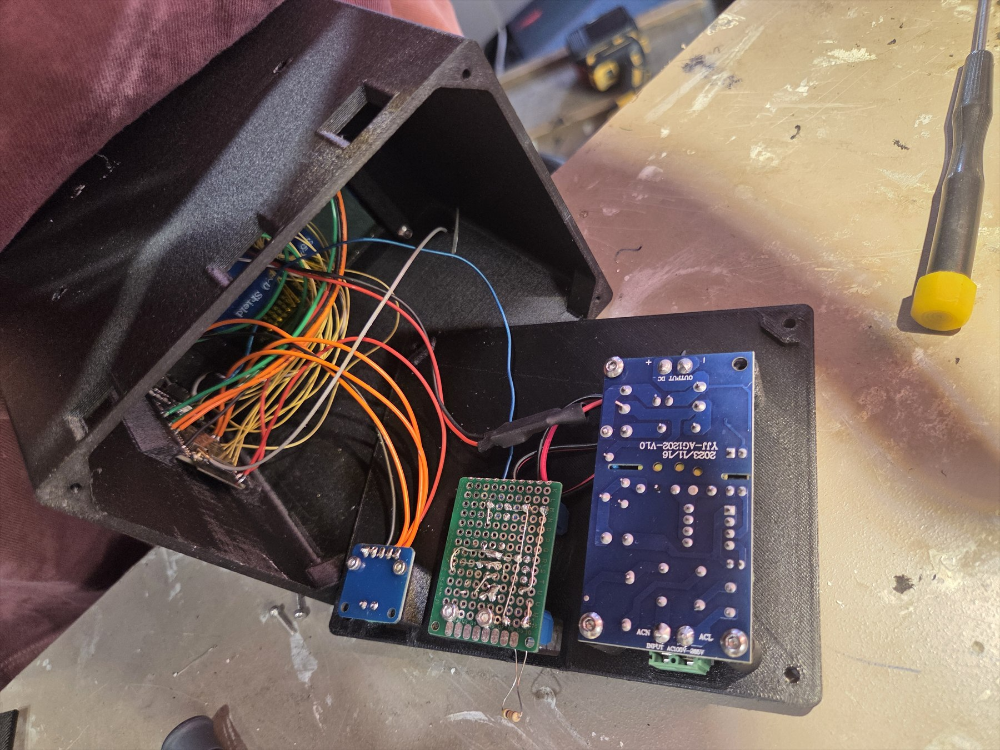
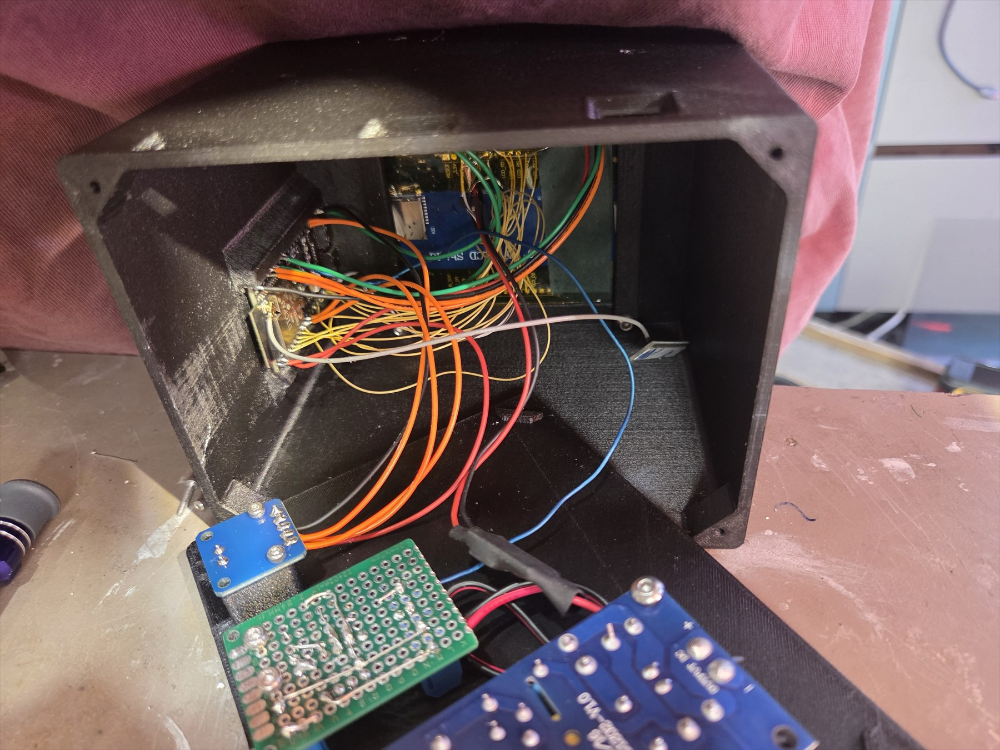
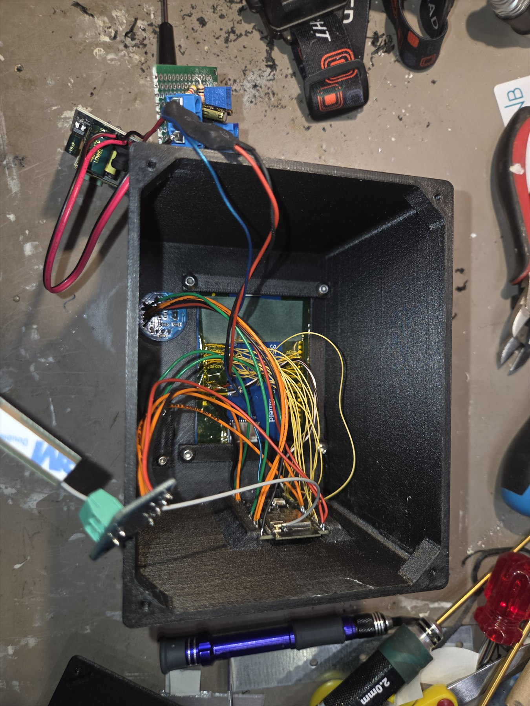
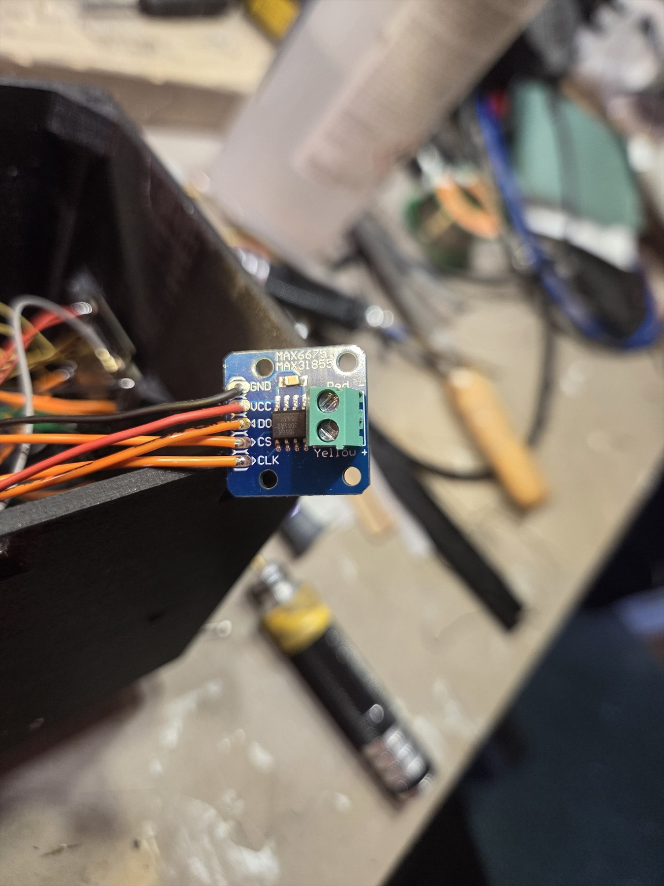
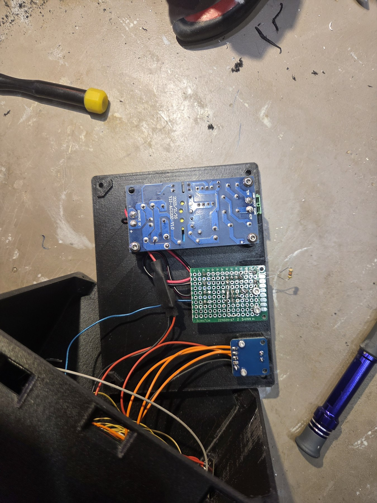

# Build photos

## Finished controller

| Front | Rear |
| --- | --- |
|  |  |

## Internal assembly

| Enclosure layout | Internal wiring |
| --- | --- |
|  |  |

## Modules and output boards

| MAX31855 interface | Output and power boards |
| --- | --- |
|  |  |

These photos document the prototype that was used to develop the firmware. Use the connection overview and pin map for wiring; photographs alone are not a substitute for checking every connection.
